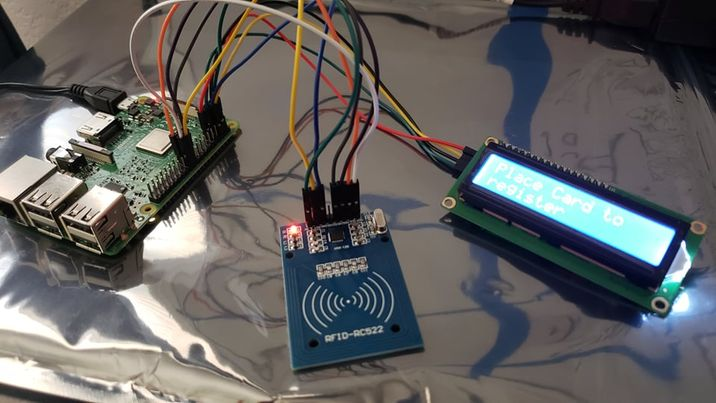

# RFID Attendance System
This is an RFID based card reader that will allow one to check in users using RFID-based scanning. The system also uses an LCD screen to tell if users are checked in or not. A log of users that have checked in or out will be tabulated in a website that can be used to measure attendance. 

| **Engineer** | **School** | **Area of Interest** | **Grade** |
|:--:|:--:|:--:|:--:|
| Aaditya | American High School | Computer Engineering | Incoming Senior

![Headstone Image]

  
# Third & Final Milestone
My third milestone was to fully integrate my LCD display and my RFID reader to work with the Raspberry Pi. I had to first rewire the RFID onto the RPi after I had soldered it. I then rewired my LCD display and then ran my attendance scripts. The scripts did not display onto the LCD as the LCD has an I2C serial interface, which did not run on the same connections as my previous code. I then found another Git LCD library and imported that into the Raspberry Pi. I then changed and edited the original attendance Python code to work with the new LCD library. Now the RFID was reading the tag and this was showing up on the LCD. 

{:target="_blank" rel="noopener"}

# Second Milestone
My second milestone was installing and setting up my RFID reader. I have already installed the LCD screen, but now I need to test whether the RFID reader is reading my chips and confirming that on the terminal. I soldered the module connection pins onto the RFID, and then wired my circuit to have each connection (MISO, GROUND, etc.) go directly to the RPi(Raspberry Pi) Pins. I then installed the MFRC522 library and enabled the SPI interface to communicate with the RC522 module. The read file will allow me to check whether the card was read or not.

{:target="_blank" rel="noopener"}

# First Milestone
My first Milestone was setting up and installing my LCD screen onto the circuit and breadboard and then testing it. The LCD is a small 6 inch by 4 inch bluelight screen that will indicate when users are checked into the database. By connecting each component's pins into the Raspberry Pi, I had set up my wiring. The 4 wires on the I2C serial interface connect to specific pins on the Raspberry Pi. I then connected power to the Raspberry Pi and then the LCD lit up. To test the LCD display, I had already downloaded the Raspberry Pi OS and the code for the LCD. The code allows me to test the LCD by running a basic clock program. I turned on the Raspberry Pi and ran the test script. The text is correctly displayed onto the LCD display, which shows that the LCD is working as intended. 

{:target="_blank" rel="noopener"}"

